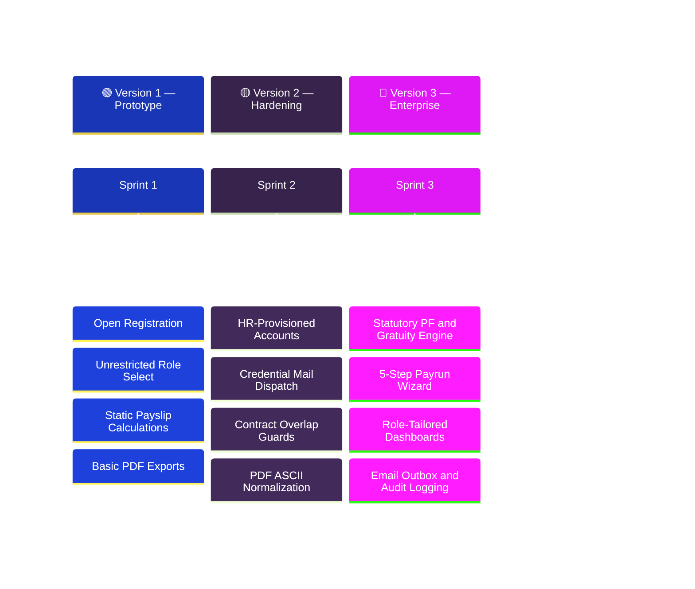
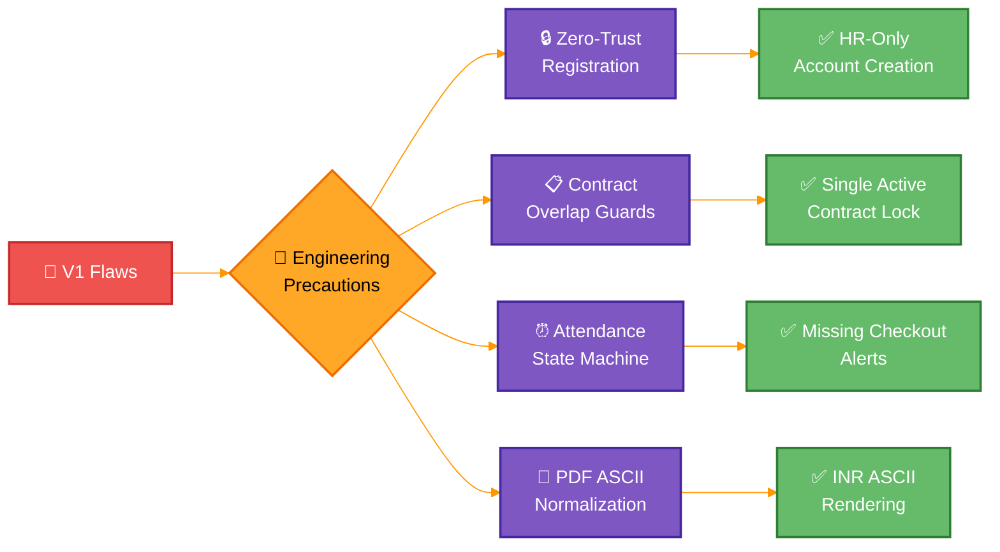
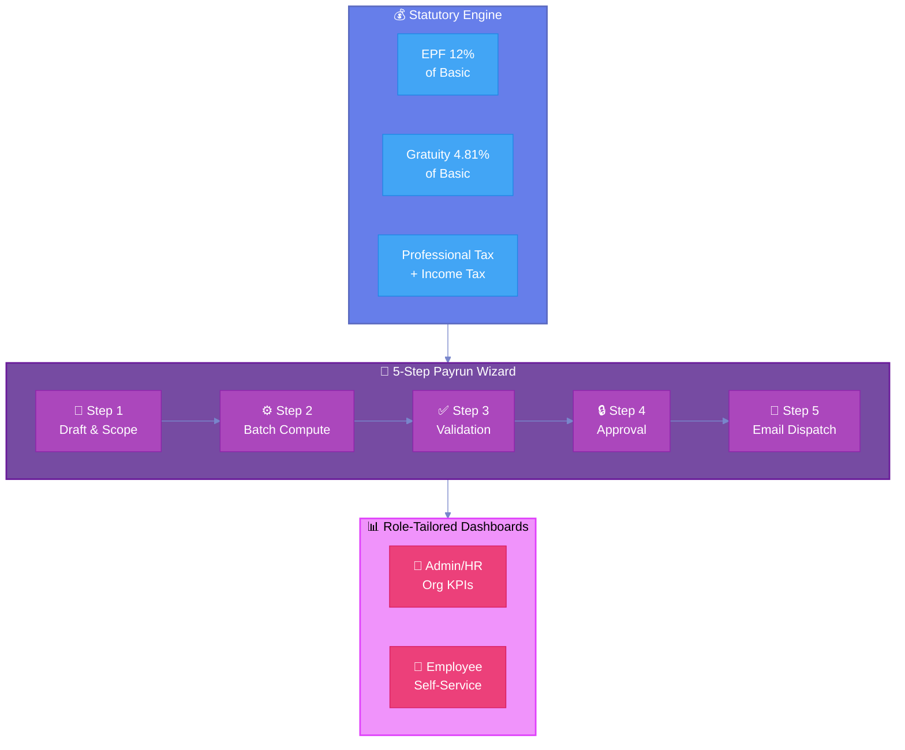
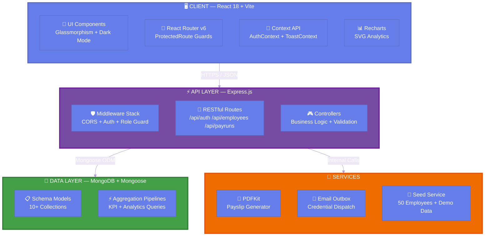
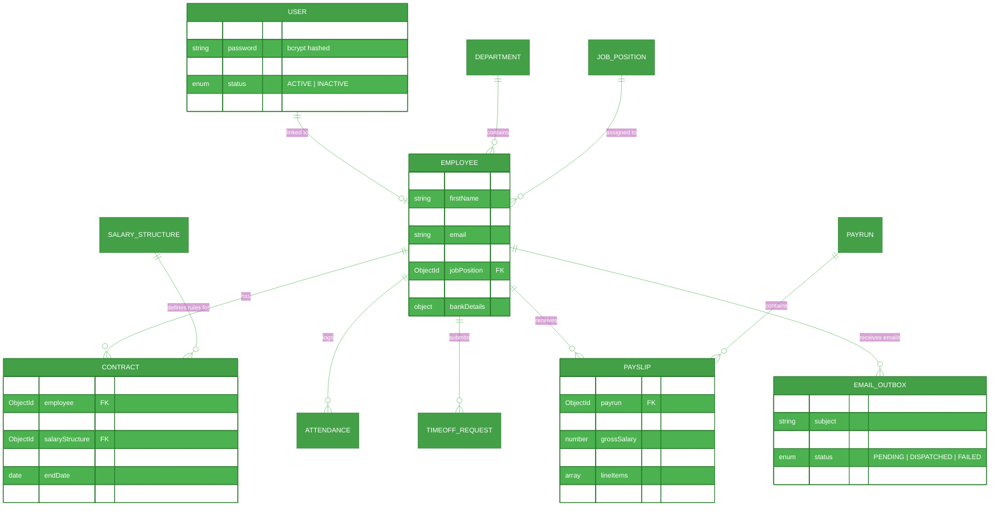
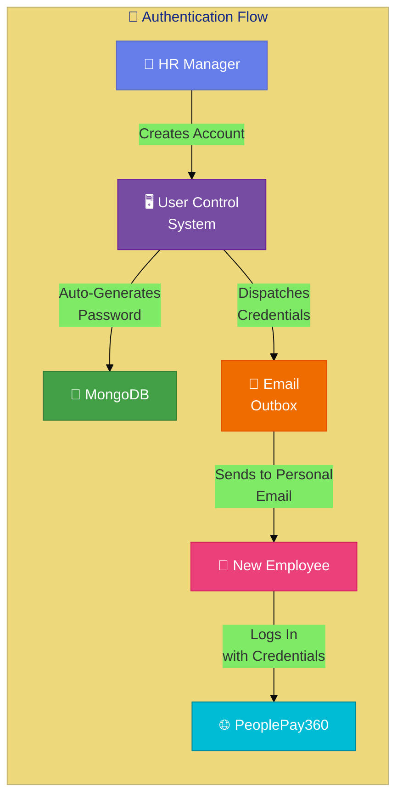

<div align="center">

<!-- ═══════════════════════════════════════════════════════════════════════ -->
<!--                        🌟 HERO SECTION 🌟                            -->
<!-- ═══════════════════════════════════════════════════════════════════════ -->


<br/>

[](https://github.com/Venkatreddy71/odoo-hackathon)
[](https://github.com/Venkatreddy71/odoo-hackathon/fork)
[](https://github.com/Venkatreddy71/odoo-hackathon/issues)
[](LICENSE)
[](https://github.com/Venkatreddy71/odoo-hackathon)

<br/>


</div>

<!-- ═══════════════════════════════════════════════════════════════════════ -->
<!--                      ⚡ TECH STACK BADGES ⚡                          -->
<!-- ═══════════════════════════════════════════════════════════════════════ -->

<div align="center">

## 🛠️ Tech Stack

### 🎨 Frontend
[](https://reactjs.org/)
[](https://vitejs.dev/)
[](https://developer.mozilla.org/en-US/docs/Web/JavaScript)
[](https://reactrouter.com/)
[](https://www.w3.org/Style/CSS/)
[](https://tailwindcss.com/)

### ⚙️ Backend
[](https://nodejs.org/)
[](https://expressjs.com/)
[](https://www.mongodb.com/)
[](https://mongoosejs.com/)

### 🔐 Security & Auth
[](https://jwt.io/)
[](https://www.npmjs.com/package/bcryptjs)

### 📊 Data Visualization & Tools
[](https://recharts.org/)
[](https://pdfkit.org/)
[](https://lucide.dev/)

</div>

<br/>


<br/>

<!-- ═══════════════════════════════════════════════════════════════════════ -->
<!--                   📖 EXECUTIVE SUMMARY                                -->
<!-- ═══════════════════════════════════════════════════════════════════════ -->

##  📖

Building **PeoplePay360** was not just about assembling an HR and payroll CRUD app — it was about designing an **enterprise-grade, fault-tolerant, and statutorily compliant human capital management system**. 

As a Lead Architect, my primary objective was to transform a standard hackathon brief into an operational system capable of handling complex organizational hierarchies, strict statutory calculations (PF & Gratuity), precise attendance tracking, and multi-tenant Role-Based Access Control (RBAC).

<br/>


<br/>

<!-- ═══════════════════════════════════════════════════════════════════════ -->
<!--                🏛️ ARCHITECTURAL EVOLUTION                             -->
<!-- ═══════════════════════════════════════════════════════════════════════ -->

##  🏛️ The V1 → V2 → V3 Journey

<div align="center">



</div>

---

### 🟢 Version 1: The Fast-Track Monolithic Prototype

<table>
<tr>
<td width="50%">

#### 💡 The Initial Approach
In the initial sprint, the goal was **velocity**: get an end-to-end MERN stack application running where users could sign up, log attendance, apply for leave, and view paystub summaries.

#### ⚡ Technical Design
- **Authentication**: Open public registration form (`/login`)
- **Payroll Logic**: Basic net salary computation
- **PDF Generation**: Standard PDFKit with UTF-8 symbols

</td>
<td width="50%">

#### 🚨 Critical Flaws Discovered

> [!CAUTION]
> **Privilege Escalation** — Anyone could register as `ADMIN` and access sensitive salary contracts

> [!WARNING]
> **Data Integrity** — Employees could have multiple active contracts, causing double salary payments

> [!WARNING]
> **PDF Crash** — UTF-8 rupee symbols (`₹`) rendered as corrupt characters (`¹`)

</td>
</tr>
</table>

---

### 🟡 Version 2: Hardening Access Controls & Operational Integrity

<div align="center">



</div>

#### 🛡️ Key Precautions & Structural Changes

| # | Challenge | Solution | Impact |
|:---:|:---|:---|:---:|
| 1 | 🔓 Public registration → unauthorized admin access | **Zero-Trust Model**: Removed public registration. HR-only provisioning via User Control System | 🟢 Critical Fix |
| 2 | 📋 Overlapping contracts → double salary payments | **Transaction Locks**: Mongoose validation + DB locks prevent concurrent active contracts | 🟢 Critical Fix |
| 3 | ⏰ Open attendance logs → corrupt time calculations | **State Machine**: `NOT_CLOCKED_IN → WORKING → CLOCKED_OUT` + dashboard alert badges | 🟡 Major Fix |
| 4 | 📄 PDF `₹` symbol → corrupt `¹` rendering | **ASCII Normalization**: Standardized to `INR` with pixel-perfect tabular layout | 🟡 Major Fix |

---

### 🔵 Version 3: Production-Grade PeoplePay360 Platform

<div align="center">



</div>

#### 🌟 Key Breakthroughs

<table>
<tr>
<td>

**🏛️ Statutory Rules (Indian Payroll)**
- **EPF**: 12% of Basic Salary
- **Gratuity**: 4.81% `(Basic × 15 / 26) / 12`
- **Allowances**: HRA, Conveyance, Medical, Special
- **Taxes**: Professional Tax, Income Tax (TDS)

</td>
<td>

**🔄 5-Step Payrun Wizard**
- `Step 1` → Draft & Select Scope
- `Step 2` → Batch Statutory Computation
- `Step 3` → Pre-Validation Check
- `Step 4` → Approval & Disbursal Lock
- `Step 5` → Email Outbox Dispatch + PDF

</td>
<td>

**📊 Role-Tailored Dashboards**
- **Admin/HR**: KPIs, cost breakdown, headcount trends
- **Employee**: Earnings history, leave balances, payslip downloads

</td>
</tr>
</table>

<br/>


<br/>

<!-- ═══════════════════════════════════════════════════════════════════════ -->
<!--                   🏗️ SYSTEM ARCHITECTURE                              -->
<!-- ═══════════════════════════════════════════════════════════════════════ -->

##  🏗️

<div align="center">



</div>

<br/>

### 💻 Frontend Architecture

| Layer | Technology | Description |
| :---: | :--- | :--- |
|  | **Core Framework** | Single-Page Application with fast HMR via Vite |
|  | **Styling & Theme** | Dark-mode enterprise palette with glassmorphism |
|  | **Routing** | Declarative routing with role-based `ProtectedRoute` guards |
|  | **State Management** | Global `AuthContext` (JWT) and `ToastContext` |
|  | **Data Visualization** | Responsive SVG charts (Area, Bar, Pie) |
|  | **Icons** | Modern vector icon system |

### ⚙️ Backend Architecture

| Layer | Technology | Description |
| :---: | :--- | :--- |
|  | **Runtime** | Non-blocking asynchronous event loop |
|  | **Web Framework** | RESTful API backend architecture |
|  | **Database** | Schema-driven document store with aggregations |
|  | **Authentication** | Salted hashing & stateless bearer token auth |
|  | **PDF Engine** | Vector-based server-side payslip compiler |

<br/>


<br/>

<!-- ═══════════════════════════════════════════════════════════════════════ -->
<!--                   🗄️ DATABASE SCHEMA                                  -->
<!-- ═══════════════════════════════════════════════════════════════════════ -->

##  🗄️

<div align="center">



</div>

<br/>


<br/>

<!-- ═══════════════════════════════════════════════════════════════════════ -->
<!--                   🌟 KEY FEATURES                                     -->
<!-- ═══════════════════════════════════════════════════════════════════════ -->

##  🌟

<div align="center">

| Module | Route | Features |
|:---|:---:|:---|
| 👥 **User Control System** | `/users` | HR-provisioned accounts • Auto-generate passwords • Email credential dispatch • Role reassignment |
| 💼 **Contract & Salary Mgmt** | `/contracts` | Single-active contract enforcement • Salary structure linking • Custom allowance rules |
| ⏱️ **Attendance Tracking** | `/attendance` | Real-time clock-in/out widget • Missing checkout alerts • Attendance quality ratios |
| 🌴 **Time Off & Leave** | `/timeoff` | Auto leave-balance deduction • PTO, Sick & Casual leave support • HR approval workflow |
| 💰 **Statutory Payroll** | `/payruns` | EPF 12% • Gratuity 4.81% • 5-step batch wizard • PDF payslip generation |
| 📊 **Analytics Dashboard** | `/dashboard` | Role-tailored KPIs • Recharts visualizations • Headcount & cost trends |
| 📧 **Email Outbox** | `/emails` | Credential dispatch • Payslip delivery • Audit trail logging |

</div>

<br/>

<div align="center">



</div>

<br/>


<br/>

<!-- ═══════════════════════════════════════════════════════════════════════ -->
<!--                   🚀 QUICK START                                      -->
<!-- ═══════════════════════════════════════════════════════════════════════ -->

##  🚀

### 📋 Prerequisites


### 1️⃣ Clone & Install

```bash
# Clone the repository
git clone https://github.com/Venkatreddy71/odoo-hackathon.git
cd odoo-hackathon

# Install server dependencies
cd server && npm install

# Install client dependencies
cd ../client && npm install
```

### 2️⃣ Environment Configuration

Create a `.env` file in the `server/` directory:

```env
PORT=5000
MONGO_URI=mongodb://127.0.0.1:27017/peoplepay360
JWT_SECRET=peoplepay360_super_secret_jwt_key_2026_hackathon
JWT_EXPIRES_IN=7d
```

### 3️⃣ Seed Demo Database

```bash
cd server
node server/services/seedService.js
```

> 📦 Populates **50 employees**, **5 departments**, contracts, **5 paid monthly payruns** (Apr – Aug 2026), **250 payslips**, and demo accounts.

### 4️⃣ Launch Application

```bash
# Terminal 1 — Backend (Port 5000)
cd server && npm run dev

# Terminal 2 — Frontend (Port 5173)
cd client && npm run dev
```

🌐 Open **`http://localhost:5173`** in your browser.

<br/>


<br/>

<!-- ═══════════════════════════════════════════════════════════════════════ -->
<!--                   🔑 DEMO CREDENTIALS                                 -->
<!-- ═══════════════════════════════════════════════════════════════════════ -->

##  🔑

<div align="center">

| Role | Email | Password | Access |
|:---:|:---|:---:|:---|
| 👑 **System Admin** | `admin@peoplepay360.com` | `admin123` | Full System Management & User Control |
| 👥 **HR Manager** | `hr@peoplepay360.com` | `hr123` | People Ops, Leaves, Contracts, User Creation |
| 💰 **Payroll User** | `payroll@peoplepay360.com` | `payroll123` | Payruns, Payslips, Salary Structures |
| 👤 **Employee** | `arav@peoplepay360.com` | `employee123` | Self-Service Portal, Attendance & Payslips |

</div>

<br/>


<br/>

<!-- ═══════════════════════════════════════════════════════════════════════ -->
<!--                   📁 PROJECT STRUCTURE                                -->
<!-- ═══════════════════════════════════════════════════════════════════════ -->

##  📁

```
odoo-hackathon/
├── 📂 client/                     # React 18 Frontend (Vite)
│   ├── 📂 src/
│   │   ├── 📂 components/
│   │   │   ├── 📂 layout/         # Header, Sidebar, ProtectedRoute
│   │   │   └── 📂 ui/             # Toast, Modal, Buttons
│   │   ├── 📂 context/            # AuthContext, ToastContext
│   │   ├── 📂 pages/              # Dashboard, Employees, Contracts, etc.
│   │   ├── 📜 App.jsx             # Root App with routing
│   │   └── 📜 main.jsx            # Entry point
│   └── 📜 vite.config.js
│
├── 📂 server/                     # Express.js Backend
│   ├── 📂 controllers/            # Business logic handlers
│   ├── 📂 middleware/              # Auth & role-based guards
│   ├── 📂 models/                 # Mongoose schemas (10+ models)
│   ├── 📂 routes/                 # RESTful API route definitions
│   ├── 📂 services/               # PDF generator, seed service
│   └── 📜 server.js               # Entry point
│
└── 📜 README.md                   # You are here! 📍
```

<br/>


<br/>

<!-- ═══════════════════════════════════════════════════════════════════════ -->
<!--                   🧪 VERIFICATION                                     -->
<!-- ═══════════════════════════════════════════════════════════════════════ -->

##  🧪

<div align="center">

| Test | Status | Details |
|:---|:---:|:---|
| 🏗️ Client Build |  | Production build via `npm run build` — 0 compilation errors |
| 🔬 Backend Tests |  | Core API & payroll engine tests via `npx jest --forceExit` |
| 🔢 Math Audit |  | 0 calculation discrepancies across EPF, Gratuity, Basic & Allowances |

</div>

<br/>

<!-- ═══════════════════════════════════════════════════════════════════════ -->
<!--                        🌊 FOOTER                                      -->
<!-- ═══════════════════════════════════════════════════════════════════════ -->

<div align="center">

<br/>


[](https://github.com/Venkatreddy71/odoo-hackathon)
[](https://github.com/Venkatreddy71/odoo-hackathon)

<p><i>Engineered with precision for PeoplePay360 — 2026 Hackathon Edition</i></p>

</div>