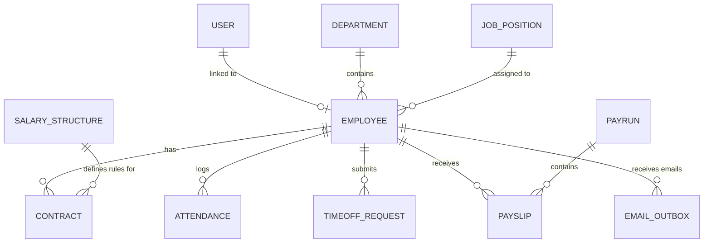

# PeoplePay360 — Next-Gen HR & Payroll Enterprise Platform

> **Author**: Lead Systems Architect & Senior Software Engineer (10+ YOE)  
> **Repository**: `odoo-hackathon` / `PeoplePay360`  
> **Tech Stack**: Node.js, Express, MongoDB, React 18 (Vite), TailwindCSS, PDFKit, JWT, Recharts  

---

## 📖 Executive Summary & Engineering Retrospective

Building **PeoplePay360** was not just about assembling an HR and payroll CRUD app — it was about designing an **enterprise-grade, fault-tolerant, and statutorily compliant human capital management system**. 

As a Lead Architect, my primary objective was to transform a standard hackathon brief into an operational system capable of handling complex organizational hierarchies, strict statutory calculations (PF & Gratuity), precise attendance tracking, and multi-tenant Role-Based Access Control (RBAC).

Below is the architectural evolution story detailing how the platform transitioned from a basic prototype to an enterprise-ready system.

---

## 🏛️ Architectural Evolution & Thought Process (The V1 → V2 → V3 Journey)

```
[ Version 1: Prototype ]        [ Version 2: Operational Hardening ]      [ Version 3: PeoplePay360 Enterprise ]
  • Open Registration             • HR-Provisioned Accounts                 • Full Statutory PF & Gratuity Engine
  • Unrestricted Role Select      • Credential Mail Dispatch to Personal    • 5-Step Automated Payrun Execution
  • Static Payslip Calculations   • Contract Overlap Guards                 • Role-Tailored Dashboards
  • Basic PDF Exports             • PDF ASCII Currency Normalization        • Email Outbox & Audit Logging
```

---

### 🟢 Version 1: The Fast-Track Monolithic Prototype
#### 💡 The Initial Approach
In the initial sprint, the goal was velocity: get an end-to-end MERN stack application running where users could sign up, log attendance, apply for leave, and view paystub summaries.

#### ⚡ Technical Design in V1
- **Authentication**: Open public registration form (`/login`) allowing any user to register with their desired role (`ADMIN`, `HR_MANAGER`, `PAYROLL_USER`, `EMPLOYEE`).
- **Payroll Logic**: Basic net salary computation (`Basic + Allowances - Unpaid Leave Deductions`).
- **PDF Generation**: Standard PDFKit output with UTF-8 currency symbols (`₹`).

#### 🚨 Critical Flaws & Architectural Bottlenecks (The Reality Check)
1. **Security Vulnerability (Privilege Escalation)**: Allowing users to select their own role during public registration meant anyone could register as an `ADMIN` or `HR_MANAGER` and access sensitive salary contracts.
2. **Data Integrity Hazards**:
   - Employees could have multiple active (`RUNNING`) contracts concurrently, causing double salary payments during payruns.
   - Employees frequently forgot to clock out, leaving open attendance records that distorted time-off deduction math.
3. **PDF Generation Crash / Encoding Artifacts**: PDFKit’s standard Helvetica font rendered UTF-8 rupee symbols (`₹`) as corrupt superscript symbols (`¹`), breaking PDF exports.

---

### 🟡 Version 2: Hardening Access Controls & Operational Integrity
#### 🧠 Refining the Approach & Engineering Precautions

To address V1's vulnerabilities, I restructured the security boundary and data models.

#### 🛡️ Key Precautions & Structural Changes
1. **Zero-Trust Registration Model**:
   - **Challenge**: Public registration creates unauthorized admin access.
   - **Solution**: Completely removed public self-registration from the login portal. Implemented an **Internal Account Provisioning Workflow** where only authorized HR Managers / Admins can create user accounts via the **User Control System** (`/users`).
   - **Credential Dispatch Safeguard**: When HR creates an account, the system auto-generates a strong random password, binds the account to the employee’s work identity, and **dispatches the login credentials directly to the employee's personal email address**.

2. **Strict Contract Overlap Guard**:
   - **Challenge**: Overlapping contracts pollute payroll generation.
   - **Solution**: Implemented transactional database locks and Mongoose validation rules. Before creating or activating a contract, the backend verifies that no active (`RUNNING`) contract exists for that employee within the requested date range.

3. **Attendance State Machine & Missing Checkout Alerting**:
   - **Challenge**: Open attendance logs corrupt attendance quality ratios.
   - **Solution**: Built an attendance state machine (`NOT_CLOCKED_IN` → `WORKING` → `CLOCKED_OUT`). Introduced real-time dashboard alert badges for "Missing Check-outs" so managers can rectify unclosed sessions prior to payroll lock.

4. **PDFKit Encoding Fix**:
   - **Challenge**: Font encoding corruption in PDF downloads.
   - **Solution**: Standardized PDF currency formatting to standard ASCII `INR`, implemented pixel-perfect tabular coordinate math, clean multi-column borders, and standardized line spacing.

---

### 🔵 Version 3: Production-Grade PeoplePay360 Platform
#### 🚀 The Final Enterprise Architecture

Version 3 represents the complete, polished enterprise platform with full statutory compliance, audit feeds, and automated payroll pipelines.

#### 🌟 Key Breakthroughs in Version 3
1. **Statutory Rules Integration (Indian Payroll Compliance)**:
   - **Provident Fund (EPF)**: Auto-computes **12% of Basic Salary** as a statutory employee deduction.
   - **Gratuity Provision**: Auto-provisions **4.81% of Basic Salary** (`(Basic * 15 / 26) / 12`) for long-term retention benefits.
   - **Allowances & Taxes**: Dynamic calculation of HRA, Conveyance, Medical, Special Allowance, Professional Tax, and Income Tax (TDS).

2. **5-Step Automated Payrun Execution Wizard**:
   - **Step 1 (Draft & Select Scope)**: Filter payrun scope by department or employment type.
   - **Step 2 (Batch Computation)**: Execute the statutory formula across all selected active contracts.
   - **Step 3 (Pre-Validation Check)**: Scan for missing bank accounts, unapproved leave, or contract mismatches.
   - **Step 4 (Approval & Disbursal)**: Lock payrun records and transition payslips to `PAID`.
   - **Step 5 (Email Outbox Dispatch)**: Automatically generate PDF payslips and log dispatch records in `EmailOutbox`.

3. **Role-Tailored UX & Real-Time Dashboards**:
   - **Admin / HR Manager**: High-level organizational KPIs, financial disbursement metrics, headcount growth trends, department cost breakdown, and operational action items.
   - **Employee Self-Service**: Individual earnings history, leave allocation balances, time-off requests, and one-click PDF payslip downloads.

---

## 🛠️ Complete Technical Stack & System Architecture

### 💻 Frontend Architecture
| Layer | Technology | Description |
| :--- | :--- | :--- |
| **Core Framework** | React 18 (Vite) | Single-Page Application (SPA) with fast HMR |
| **Styling & Theme** | Vanilla CSS + TailwindCSS | Dark-mode enterprise palette with smooth glassmorphism |
| **Routing** | React Router v6 | Declarative client-side routing with role-based `ProtectedRoute` guards |
| **State & Context** | React Context API | Global `AuthContext` (JWT & profile state) and `ToastContext` |
| **Analytics & Data Vis** | Recharts | Responsive SVG charts (Area, Bar, Pie charts) |
| **Icons** | Lucide React | Modern vector icon system |

### ⚙️ Backend Architecture
| Layer | Technology | Description |
| :--- | :--- | :--- |
| **Runtime Environment** | Node.js (v18+) | Non-blocking asynchronous event loop |
| **Web Framework** | Express.js | RESTful API backend architecture |
| **Database & ODM** | MongoDB + Mongoose | Schema-driven document store with population & aggregations |
| **Authentication** | JWT + BcryptJS | Salted password hashing & stateless bearer token auth |
| **PDF Generation** | PDFKit | Vector-based server-side payslip PDF compiler |

---

## 🗄️ Database Schemas & Data Relationships



### Key Models Overview
- **`User`**: `email`, `password` (bcrypt hashed), `role` (`ADMIN`, `HR_MANAGER`, `PAYROLL_USER`, `EMPLOYEE`), `status` (`ACTIVE`, `INACTIVE`), `employee` (Ref).
- **`Employee`**: `employeeId`, `firstName`, `lastName`, `email`, `department`, `jobPosition`, `joiningDate`, `bankDetails` (`accountNumber`, `ifscCode`, `bankName`).
- **`Contract`**: `contractRef`, `employee`, `wage` (Monthly Base), `salaryStructure`, `startDate`, `endDate`, `status` (`RUNNING`, `EXPIRED`, `CANCELLED`).
- **`Payslip`**: `employee`, `payrun`, `basicSalary`, `allowances`, `grossSalary`, `deductions` (PF, Tax, Unpaid Leave), `netSalary`, `lineItems`, `status` (`DRAFT`, `PAID`).
- **`EmailOutbox`**: `recipient`, `subject`, `employee`, `attachmentName`, `status` (`PENDING`, `DISPATCHED`, `FAILED`), `sentTime`.

---

## 🌟 Key System Modules & Features

### 1. 👥 User Control System (`/users`)
- HR Managers and Admins can create new system accounts.
- Features **⚡ Auto-Generate Password** to create strong credentials.
- Mails account details directly to the employee's personal email address.
- Allows role reassignment, profile unlinking, and account deletion with safety guards against self-deletion.

### 2. 💼 Contract & Salary Management (`/contracts`)
- Enforces single-active contract constraints per employee.
- Links salary structures with custom allowance/deduction rules.

### 3. ⏱️ Attendance & Working Schedules (`/attendance`)
- Real-time live header clock-in / clock-out widget with active session counter.
- Flags missing check-outs and computes attendance quality ratios.

### 4. 🌴 Time Off & Leave Allocations (`/timeoff`)
- Automated leave balance deduction upon HR approval.
- Supports Paid Time Off, Sick Leave, and Casual Leave allocations.

### 5. 💰 Statutory Payroll Engine (`/payruns` & `/payslips`)
- Calculates Basic, HRA, Statutory EPF (12%), Gratuity (4.81%), and Unpaid Leave deductions based on working schedule days.
- 5-step batch payrun execution wizard.
- Direct PDF downloads rendered with standard ASCII headers (`INR`) and sharp tabular formatting.

---

## ⚡ Local Setup & Execution Guide

### Prerequisites
- Node.js (v18.x or higher)
- MongoDB running locally on `mongodb://127.0.0.1:27017/peoplepay360` (or MongoDB Atlas URI)

### 1. Clone & Install Dependencies
```bash
git clone https://github.com/Venkatreddy71/odoo-hackathon.git
cd odoo-hackathon

# Install server dependencies
cd server
npm install

# Install client dependencies
cd ../client
npm install
```

### 2. Environment Configuration
Create a `.env` file in the `server/` directory:
```env
PORT=5000
MONGO_URI=mongodb://127.0.0.1:27017/peoplepay360
JWT_SECRET=peoplepay360_super_secret_jwt_key_2026_hackathon
JWT_EXPIRES_IN=7d
```

### 3. Seed Initial Demo Database
To populate 50 employees, 5 departments, contracts, 5 paid monthly payruns (Apr - Aug 2026), 250 payslips, and demo accounts:
```bash
cd server
node server/services/seedService.js
```

### 4. Launch Application
Start backend and client servers concurrently:
```bash
# Terminal 1 (Backend Server - Port 5000)
cd server
npm run dev

# Terminal 2 (React Client - Port 5173)
cd client
npm run dev
```

Open your browser at `http://localhost:5173`.

---

## 🔑 Demo Account Credentials

| Role | Work Email | Password | Access Level |
| :--- | :--- | :--- | :--- |
| **System Admin** | `admin@peoplepay360.com` | `admin123` | Full System Management & User Control |
| **HR Manager** | `hr@peoplepay360.com` | `hr123` | People Ops, Leaves, Contracts, User Creation |
| **Payroll User** | `payroll@peoplepay360.com` | `payroll123` | Payruns, Payslips, Salary Structures & Rules |
| **Employee** | `arav@peoplepay360.com` | `employee123` | Self-Service Portal, Attendance & Payslips |

---

## 🧪 Verification & Quality Assurance

- **Client Build**: Verified production build using `npm run build` in `client/` (0 compilation errors).
- **Backend Unit Tests**: Verified passing 2/2 core API & payroll engine tests via `npx jest --forceExit`.
- **Mathematical Audit**: Verified 250 generated payslips with 0 calculation discrepancies across basic, allowance, EPF, and gratuity lines.

---

*Engineered with precision for PeoplePay360 — 2026 Hackathon Edition.*